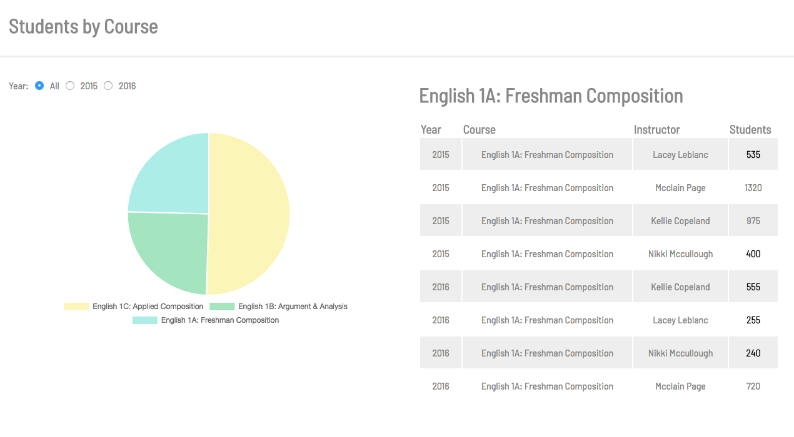

# Student Courses

Single Page Web Application which displays a Pie Chart and Grid. Renders information regarding student and course information. Both desktop application and mobile compatible.

# Setup
1. Install node packages
    - `npm install`
2. Start server
    - `node ./backend/server.js`
3. Go to port 3000
    - `http://localhost:3000/#/`
4. Enjoy
    